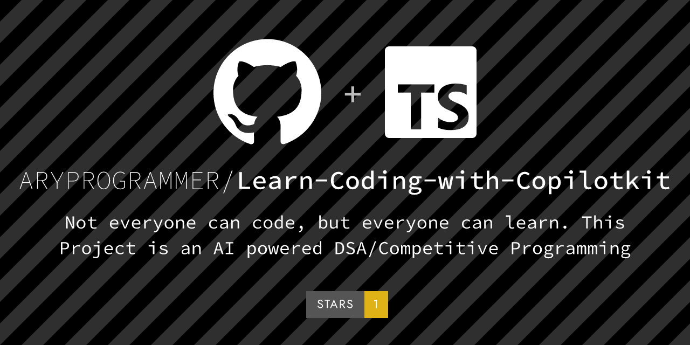
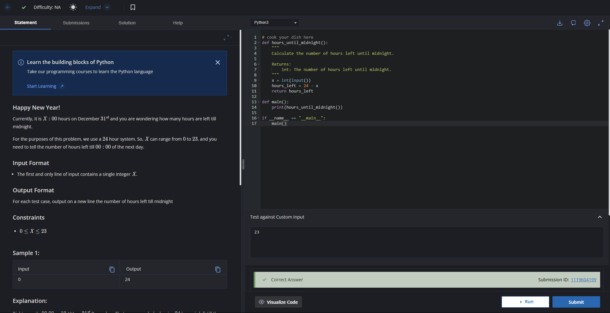
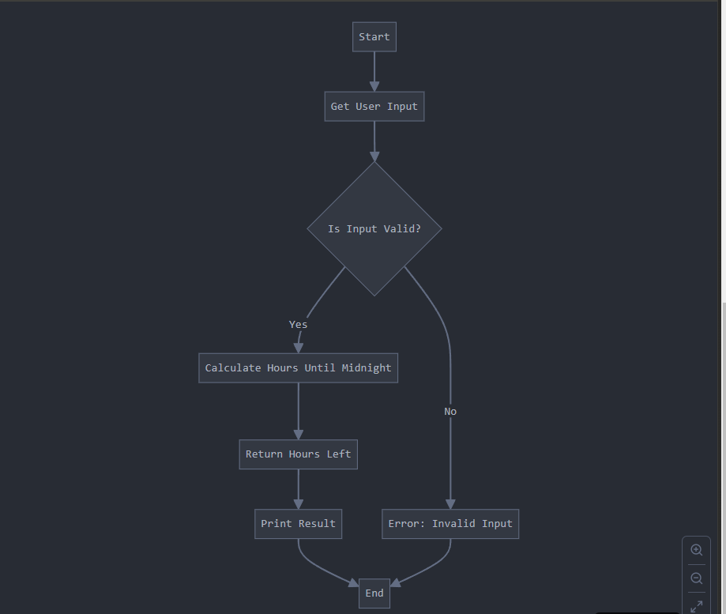
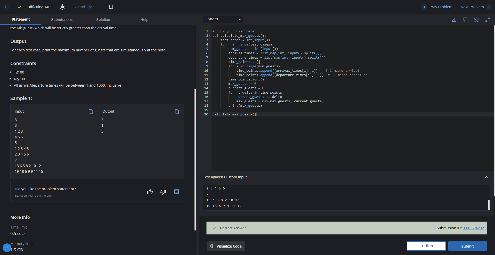
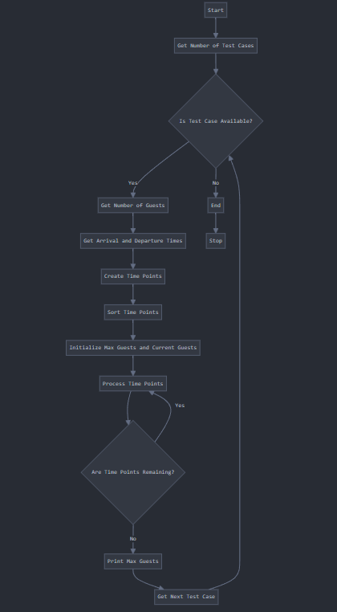

<div align="center">  

   # Learn Coding with CopilotKit, CoAgents, and LangGraphs 🚀  
    
</div>  

<div align="center">  
  <a href="https://github.com/copilotkit">  
      
  </a>  
  <a href="https://nextjs.org/">  
      
  </a>  
  <a href="https://youtu.be/E1q67IDcdMU">  
      
  </a>    
  
  <a href="https://youtu.be/XpOeWhbxqOY">  
      
  </a>  
  
  <a href="https://learn-coding-with-copilotkit.vercel.app/">  
      
  </a>  
</div>

---

## 📖 **About**  

**Not everyone can code, but everyone can learn.**  

This project is an AI-powered **DSA/Competitive Programming Helper** with an inbuilt editor to help you:  
- Prepare for **coding interviews**  
- Start learning how to code from scratch  
- **Visualize everything** with intuitive representations  

**Experience the future of coding education!**  

🌐 Live Demo: [learn-coding-with-copilotkit.vercel.app](https://learn-coding-with-copilotkit.vercel.app/)  

---

## 🌟 **Why CopilotKit?**  

- **Seamless Integration**: Build AI copilots that enhance user experiences effortlessly.  
- **Open Source**: Join a thriving community of developers using and contributing to CopilotKit.  
- **Future-Ready**: Perfect for in-app AI agents, context-aware chatbots, shared state and beyond!  

Learn more about [CopilotKit](https://github.com/copilotkit).  

---


## 🛠️ **Project Description**  

Learn coding in a revolutionary way using **CopilotKit**, **CoAgents**, and **LangGraphs**! This project showcases how cutting-edge tools can simplify coding education through interactive UI and AI-driven technologies.  

### Key Features:  
- **🌐 CopilotKit**: Effortlessly integrate AI copilots into your apps, enabling in-app chatbots, context-aware interactions, and more.  
- **🤖 CoAgents**: A robust infrastructure for connecting LangGraph agents to humans in the loop, enabling seamless collaboration.  
- **📊 LangGraphs**: Visual representations of programming languages to simplify understanding of their structure and syntax.  
- **🖥️ Inbuilt Editor**: A powerful coding editor designed to boost productivity and learning.  

---


## Screenshots

<details>
  <summary>View Achieved Accuracy</summary>
  
  <div align="center">
    
    
    
    
  </div>

</details>


## 🏗️ **Tech Stack**  

### Frontend:  
- [Next.js](https://nextjs.org/)  
- [ShadCN UI](https://shadcn.dev/)  
- [Tailwind CSS](https://tailwindcss.com/)  
- [CopilotKit-UI](https://github.com/copilotkit)  

### Backend:  
- [Python](https://www.python.org/)  
- [FastAPI](https://fastapi.tiangolo.com/)  
- [LangGraphs](https://langgraphs.example)  
- [CopilotKit](https://github.com/copilotkit)  

### APIs:  
- [Groq](https://groq.com/)  
- [Llama-70B](https://example.com/)  

---

## 📚 **Topics Covered**  

- **TypeScript**  
- **Next.js**  
- **Competitive Programming**  
- **Tailwind CSS**  
- **Render Deployment**  
- **Koyeb API**  
- **ShadCN-UI**  
- **Llama-70B**  
- **Groq AI**  
- **CopilotKit**  
- **LangGraph (Python)**  
- **CoAgents**  

---

## ⚙️ **Installation**  

Clone the repository:  

```bash  
git clone https://github.com/<your-repo-name>.git  
```  

---

### 🧩 **Configuration**  

1. Install the dependencies for the backend:  

   ```bash  
   cd agent  
   poetry install  
   ```  

2. Create a `.env` file in the `./agent` directory:  

   ```plaintext  
   GROQ_API_KEY=your_groq_api_key_here  
   ```  

3. Run the demo:  

   ```bash  
   poetry run demo  
   ```  

---

### 🖥️ **Running the UI**  

1. Install the dependencies for the frontend:  

   ```bash  
   cd ./frontend-interface  
   npm i --legacy-peer-deps  
   ```  

2. Create a `.env` file in the `./frontend-interface` directory:  

   ```plaintext  
   GROQ_API_KEY=your_groq_api_key_here  
   ```  

3. Run the Next.js project:  

   ```bash  
   npm run dev  
   ```  

4. Navigate to [http://localhost:3000](http://localhost:3000).  

---

### 🖥️ **Running the Backend**  

1. Install the dependencies for the backend:  

   ```bash  
   cd ./backend  
   pip install -r -requirements.txt  
   ```  

2. Create a `.env` file in the `./frontend-interface` directory:  

   ```plaintext  
   GROQ_API_KEY=your_groq_api_key_here  
   ```  

3. Run the FAST API server:  

   ```bash  
   python run_agent.py  
   ```    

---


## 🧑‍💻 **Usage**  

1. **Launch LangGraph Studio**:  
   Run LangGraph Studio and load the `./agent` folder into it.  

2. **Ensure proper configuration**: Make sure the `.env` file is properly configured as mentioned in the setup steps.  

---

## 🔧 **Troubleshooting**  

If you encounter any issues, try the following:  

1. Ensure no other application is running on port `8000`.  
2. In `/agent/dsa_agent/demo.py`, change `0.0.0.0` to `127.0.0.1` or `localhost`.  

---

## 📜 **License**  

This project is  [UN Licensed](LICENSE).  

---

Give CopilotKit a ⭐ on [GitHub](https://github.com/copilotkit) if you love it!  

